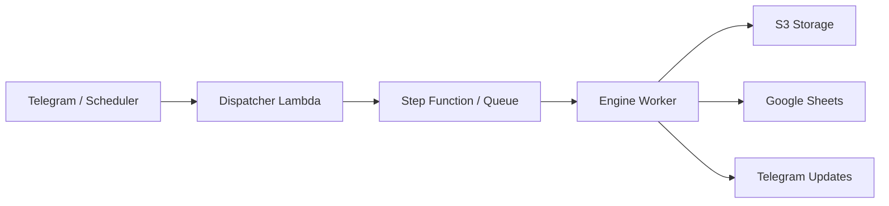

# Zeteon

Zeteon is an automated content pipeline for turning a topic into a publish-ready short video. The project combines Telegram-driven triggers, AWS-based orchestration, and a LangGraph workflow for script generation, audio synthesis, image generation, video assembly, and upload.

## What this repository contains

- app/dispatcher: Lambda and webhook-driven entrypoints for triggering the pipeline from Telegram or scheduled events.
- app/engine: The main worker pipeline and workflow nodes that generate the video assets.
- infra: Terraform definitions for AWS infrastructure such as Lambda, ECS, Step Functions, and storage.

## AI-focused tech stack

Zeteon is built around an AI content generation workflow that combines multiple services and models:

- LangGraph for orchestrating the multi-step video generation pipeline.
- Google Gemini models for idea generation, prompt creation, and image generation.
- ElevenLabs for text-to-speech voice generation.
- Anthropic Claude for prompt refinement and script/image assistance.
- Python and asyncio for workflow execution and orchestration.
- AWS S3, ECS, Lambda, Step Functions, and DynamoDB for scalable deployment and state management.
- Google Sheets and Telegram for workflow status tracking and human interaction.

## AI pipeline overview

The system turns a simple topic into a video by chaining together AI-powered stages:

1. Idea generation using Gemini.
2. Script generation and prompt refinement.
3. Voice generation using ElevenLabs.
4. Image generation using Gemini-based image models.
5. Video assembly and publishing workflows.
6. Status reporting through Telegram and Google Sheets.

## Architecture at a glance



1. A Telegram command or scheduled event triggers the dispatcher.
2. The dispatcher records the request and launches the workflow.
3. The engine runs a LangGraph workflow with steps for:
   - script generation
   - audio generation
   - image generation
   - video assembly
   - final upload
4. Results are written to S3 and status updates are pushed to Google Sheets and Telegram.

## How it works

- A user submits a topic through Telegram or a scheduled event.
- The dispatcher records the request and prepares the workflow run.
- The engine pulls the topic, generates the required assets, and uploads the final video.
- Progress updates are shared back to Telegram and the workflow tracker.
- Infrastructure is managed with Terraform so the deployment stays repeatable.

## Setup screenshots

Add screenshots here once you have local setup or deployment visuals:

- Telegram trigger example
- Google Sheets status tracker
- AWS deployment overview
- Local engine run output

## Project layout

```text
app/
  dispatcher/
    lambda_webhook.py
    lambda_scheduled.py
    lambda_manual.py
    utils/
    Dockerfile
  engine/
    main.py
    nodes/
    utils/
    Dockerfile
infra/
  live/
    app_services/
    data_store/
    global/
```

## Prerequisites

- Python 3.10+
- Docker (optional, for containerized runs)
- AWS access for S3, Step Functions, ECS, and DynamoDB
- Google Sheets / YouTube credentials
- Telegram bot credentials

## Environment variables

The application expects a number of environment variables. At minimum, configure the following:

### Core
- APP_ENV=local or production
- AWS_DEFAULT_REGION
- AWS_ACCESS_KEY_ID
- AWS_SECRET_ACCESS_KEY
- S3_BUCKET_NAME

### Telegram
- BOT_TOKEN
- CHAT_ID

### Google / Sheets
- G_SPREADSHEET_NAME
- SHEET_NAME

### AI / model providers
- GEMINI_API_KEY
- GEMINI_API_KEY_1
- GEMINI_API_KEY_2
- ELEVENLABS_API_KEY
- CARTESIA_API_KEY
- CLAUDE_API_KEY

### Workflow / infra
- DYNAMO_TABLE_NAME
- STEP_FUNCTION_ARN
- ECS_CLUSTER_NAME
- ECS_TASK_DEFINITION
- ECS_SUBNET_ID
- ECS_SECURITY_GROUP

## Local development

### 1. Create a virtual environment

```bash
python -m venv .venv
source .venv/bin/activate
```

On Windows PowerShell:

```powershell
python -m venv .venv
.\.venv\Scripts\Activate.ps1
```

### 2. Install dependencies

```bash
pip install -r app/engine/requirements.txt
pip install -r app/dispatcher/requirements.txt
```

### 3. Run the engine locally

```bash
cd app/engine
python main.py
```

### 4. Run dispatcher locally

The dispatcher handlers are intended for Lambda-style execution, but they can be exercised locally if your environment variables are configured.

## Docker

Build and run the engine container:

```bash
docker build -t zeteon-engine app/engine
docker run --rm --env-file .env zeteon-engine
```

Build and run the dispatcher container:

```bash
docker build -t zeteon-dispatcher app/dispatcher
docker run --rm --env-file .env zeteon-dispatcher
```

## Infrastructure

Terraform files are located under infra/. They are used to provision the cloud resources needed by the application pipeline.

Typical deployment targets include:
- Lambda functions for Telegram/webhook handling
- ECS for long-running worker jobs
- Step Functions for orchestration
- S3 for generated media and secrets
- DynamoDB for workflow state

## Security notes

- Do not commit secrets, credentials, or token files.
- Prefer AWS Secrets Manager or SSM Parameter Store for sensitive configuration.
- Keep local environment files out of source control.

## Contributors

Contributions are welcome. If you want to help improve Zeteon:

1. Fork the repository.
2. Create a feature branch.
3. Make your changes and test them locally.
4. Open a pull request with a clear summary of the update.

If you are working on documentation, infrastructure, or workflow improvements, your help is appreciated.

## Notes

This repository is already connected to GitHub as the remote repository named Zeteon.
